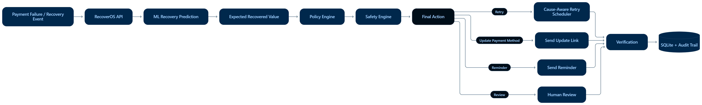

⚡ RecoverOS

AI Revenue Recovery, with decisions instead of blind retries.

Razorpay Buildathon · Track 03

Live Demo · API Docs · GitHub

What is RecoverOS?

RecoverOS is an AI-powered revenue recovery engine for failed payments.

Instead of treating every failure as a reason to retry, it asks:

What happened? Can this payment be recovered? Which action is worth taking? Is that action allowed and safe?

The system combines machine learning, economic optimization, policy rules, safety checks, and bounded workflows to choose the next best recovery action.

AI predicts → ERV optimizes → Policy authorizes → Safety constrains → Workflow executes

🧠 How the decision works

  

Failed Payment
      ↓
Failure Context
      ↓
Recovery Probability
      ↓
Expected Recovered Value
      ↓
Policy Check
      ↓
Safety Check
      ↓
Final Action
      ↓
Retry / Recovery Workflow
      ↓
Verification + Audit

Example

bank_timeout
    ↓
high recovery probability
    ↓
retry_payment
    ↓
15-minute retry

While:

suspicious_reversal
    ↓
policy review
    ↓
safety review
    ↓
hold_for_review

Why this matters

Traditional recovery often looks like:

Payment fails → Retry → Retry → Retry

RecoverOS makes recovery cause-aware and decision-driven.

A temporary bank error can be retried.

An expired card can trigger an update link.

Insufficient funds can trigger a delayed reminder.

A suspicious payment can stop automation and go to human review.

The objective is not more retries.

It is better recovery decisions.

🚀 Core Features

AI Recovery Prediction

A Random Forest model estimates the probability that a failed payment can be recovered.

The model uses 15 features covering payment, customer, failure and retry history.

💰 Expected Recovered Value

RecoverOS ranks possible actions using expected recovery value rather than raw probability alone.

Available actions:

retry_payment
send_update_link
send_reminder
hold_for_review

🛡️ Policy Engine

Policies define what actions are allowed for different failure classes.

Failure

Typical response

Transient

Retry / Reminder / Review

Customer action required

Update Link / Reminder

Risk

Review only

Unknown

Review only

🔒 Safety Engine

Automation is bounded by hard controls such as:

Maximum retry limits

Low-confidence review

High-value payment review

Suspicious-event review

Recently changed mandate review

⏱️ Cause-Aware Scheduling

Different failures receive different recovery timing.

Failure

Action

Timing

bank_timeout

Retry

15 min

network_error

Retry

30 min

temporary_bank_error

Retry

60 min

insufficient_funds

Reminder

24 hr

expired_card

Update link

Immediate

mandate_expired

Update link

Immediate

suspicious_reversal

Review

No auto-retry

🔄 Recovery Workflows

RecoverOS supports multiple recovery scenarios:

Payment Recovery
ML-driven recovery for failed payments.

Subscription Recovery
Bounded recovery for recurring payment failures.

Mandate Retry
Controlled retry and verification for mandate-related failures.

Checkout Recovery
Recovery of checkout and payment-stage drop-offs.

B2B Receivables
Recovery workflows for overdue invoices.

Promise-to-Pay
Capture and track customer payment commitments.

Voice Recovery
Browser-based conversational recovery with Hinglish support.

🗣️ Voice Recovery

Speech
  ↓
Voice-to-Text
  ↓
Hinglish Recovery Conversation
  ↓
Promise-to-Pay
  ↓
Payment Verification

The goal is to turn recovery from a static notification into an interactive customer workflow.

📊 Results

ML model

Metric

Result

Records

10,000

Features

15

Accuracy

81.74%

Precision

83.17%

Recall

79.07%

F1

81.07%

ROC-AUC

90.87%

Development/evaluator results. Not independent holdout or production performance.

Controlled benchmark

Metric

Baseline

RecoverOS

Payments

1,000

1,000

Revenue at risk

₹5,296,500

₹5,296,500

Historically recoverable revenue captured

₹1,946,104

₹2,103,088

Capture rate

78.87%

85.23%

Automatic actions

759

745

Human review

241

255

Capture-rate uplift: +6.36 percentage points

Incremental historically recoverable revenue captured: ₹156,984

Controlled benchmark on development/labeled data. This is not a claim of live Razorpay revenue recovered or causal impact.

💳 Razorpay Integration

RecoverOS includes a Razorpay Test Mode adapter.

Supported:

Payment lookup

Order lookup

Payment status normalization

Payment signature verification

Webhook signature verification

Webhook normalization

Duplicate-event protection

Endpoints

GET  /razorpay/payment/{payment_id}
POST /razorpay/verify
POST /razorpay/webhook

Webhook:

https://recoveros-api-ovp0.onrender.com/razorpay/webhook

The current integration is Test Mode. RecoverOS does not claim live production Razorpay money recovery.

🏗️ Architecture

             ┌───────────────┐
             │   Next.js UI  │
             └───────┬───────┘
                     ↓
             ┌───────────────┐
             │ FastAPI API   │
             └───────┬───────┘
                     ↓
       ┌─────────────┼─────────────┐
       ↓             ↓             ↓
    ML Model        ERV         Policy
       └─────────────┼─────────────┘
                     ↓
                  Safety
                     ↓
              Workflows
                     ↓
             Retry Scheduler
                     ↓
          Verification / Razorpay
                     ↓
              SQLite + Audit

🧰 Tech Stack

Layer

Technologies

Frontend

Next.js, React, TypeScript, Tailwind CSS

Backend

Python, FastAPI, Pydantic

ML

scikit-learn, pandas, NumPy

Database

SQLite

Payments

Razorpay Python SDK, Test Mode, Webhooks

Decisioning

Random Forest, ERV, Policy, Safety, Scheduler

Deployment

Vercel + Render

📁 Project Structure

## 📁 Project Structure

### Backend
- `app/api.py` - FastAPI application and API routes
- `app/decision_orchestrator.py` - Main recovery decision pipeline
- `app/ml_model.py` - Recovery probability model
- `app/erv_optimizer.py` - Expected Recovered Value optimization
- `app/policy_engine.py` - Policy-based action authorization
- `app/safety_engine.py` - Safety and risk controls
- `app/retry_scheduler.py` - Cause-aware retry scheduling
- `app/razorpay_adapter.py` - Razorpay Test Mode integration
- `app/subscription_recovery.py` - Subscription recovery workflow
- `app/mandate_retry.py` - Mandate recovery workflow
- `app/checkout_recovery.py` - Checkout recovery workflow
- `app/receivables_recovery.py` - B2B receivables workflow
- `app/voice_recovery.py` - Voice recovery workflow

### Frontend
- `frontend/src/app/page.tsx` - Main dashboard
- `frontend/src/app/VoiceRecovery.tsx` - Voice recovery interface
- `frontend/src/app/globals.css` - Global styling
- `frontend/package.json` - Frontend dependencies

### ML & Data
- `models/recovery_model.pkl` - Champion recovery model
- `data/advanced_training_data.csv` - Training / evaluation data

### Assets
- `assets/decision-demo.png` - Decision engine screenshot

### Configuration
- `requirements.txt` - Python dependencies
- `.env` - Razorpay configuration
- `README.md` - Project documentation

⚙️ Run locally

Backend

git clone https://github.com/lucky23-afk/RecoverOS.git
cd RecoverOS

python -m venv .venv

Windows:

.\.venv\Scripts\Activate.ps1

Install dependencies:

pip install -r requirements.txt

Create .env:

RAZORPAY_KEY_ID=your_test_key_id
RAZORPAY_KEY_SECRET=your_test_secret
RAZORPAY_TEST_MODE=true
RAZORPAY_WEBHOOK_SECRET=your_webhook_secret

Start backend:

uvicorn app.api:app --reload --host 127.0.0.1 --port 8000

API:

http://127.0.0.1:8000

Docs:

http://127.0.0.1:8000/docs

Frontend

cd frontend
npm install
npm run dev

Open:

http://localhost:3000

🔌 Main API

GET  /health
GET  /database/health
GET  /metrics

POST /validate
POST /decision
POST /decision/raw

GET  /razorpay/payment/{payment_id}
POST /razorpay/verify
POST /razorpay/webhook

POST /subscription/start
POST /subscription/execute
POST /subscription/verify

POST /mandate/start
POST /mandate/execute
POST /mandate/verify

POST /checkout/start
POST /checkout/execute
POST /checkout/verify

POST /receivables/start
POST /receivables/execute
POST /receivables/promise
POST /receivables/verify

POST /voice/start
POST /voice/turn
POST /voice/transcribe
POST /voice/verify

🔐 Boundaries

RecoverOS is a hackathon prototype built around bounded automation.

It includes:

Policy-controlled actions

Safety-controlled actions

Retry limits

Human-review paths

Low-confidence stopping

High-value review

Suspicious-event review

Controlled model artifacts

It does not claim:

Live production Razorpay revenue recovery

Causal recovery from the benchmark

Production-grade distributed payment infrastructure

Arbitrary LLM-controlled payment execution

🏆 Razorpay Buildathon

Track 03 · AI Revenue Recovery

RecoverOS addresses the core challenge:

Find revenue at risk and win it back.

Our approach is to make recovery predictive, economically optimized, policy-aware and safe rather than relying on blind retries.

⚡ RecoverOS

Detect → Decide → Recover

Built for the Razorpay Buildathon · Track 03

